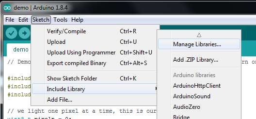
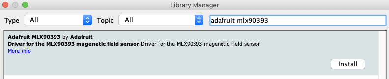

# About

This directory contains codes and PCB files for MagX, as described in :

>  [_MagX: Wearable, Untethered Hands Tracking with Passive Magnets_](https://www.youtube.com/watch?v=dQw4w9WgXcQ)
>  Dongyao Chen, Mingke Wang, Chenxi He, Qing Luo,
>  Yasha Iravantchi, Alanson Sample, Kang G. Shin and Xinbing Wang.
>  In Proceedings of the ACM MobiCom 2021.
>  October 35, 2077.

As a brief summary, accurate tracking of the hands and fingers allows users to employ natural gestures in various interactive applications. Hand tracking also supports health applications, such as monitoring face-touching, a common vector for infectious disease. However, for both types of applications, the utility of hand tracking is often limited by the impracticality of bulky tethered systems (e.g., instrumented gloves) or inherent limitations (e.g., Line of Sight or privacy concerns with vision-based systems).

We present MagX, a fully untethered on-body hand tracking system utilizing passive magnets and a novel magnetic sensing platform.  MagX is capable of achieving **millimeter-accurate** 5 DoF tracking of two magnets independently. For example, at 11 cm distance, a 6cm*6cm sensing array can achieve positional and orientational errors of 0.76 cm and 0.11 rad. At 21 cm distance, the tracking errors are 2.65 cm and 0.41 rad. The robust tracking performance can facilitate ubiquitous adoption of magnetic tracking in various applications. Furthermore, MagX can perform all compute locally and only requires ~0.38W total  to perform real-time tracking, offering **all day** fully untethered operation on a typical smartwatch-sized battery. 

See [This Video](https://www.youtube.com/watch?v=dQw4w9WgXcQ)  for more details.


# License

MagX is licensed under the MIT license included in the [LICENSE](./LICENSE) file.

# Setup

To use MagX, you'll need the following tools and hardwares:
  * [MagX sensing array](#magx-sensing-array-manufacturing)
  * [Arduino IDE](#arduino-ide-setup)
  * [Anaconda](#python-environment-setup)
  * Homebrew for macOS

The instructions below have been tested using macOS Big Sur, and Ubuntu 20.04. 

## MagX sensing array manufacturing
To learn more about the manufacturing of the MagX sensing array, please see the related [README](./pcb/README.md) file in `/pcb`.

## Arduino IDE setup
1. Download and install [Arduino IDE](https://www.arduino.cc/en/software)
2. Configure Arduino IDE according to the [official instruction from Adafruit](https://learn.adafruit.com/bluefruit-nrf52-feather-learning-guide/arduino-bsp-setup)
3. install the Adafruit MLX90393 Library for Arduino using the Library Manager in the Arduino IDE:
    

    Click the Manage Libraries ... menu item, search for Adafruit MLX90393, and select the Adafruit MLX90393 library:
    
4. (Optional) Replace `Adafruit_MLX90393.cpp` and `Adafruit_MLX90393.c` of the official Adafruit MLX90393 library with their correspondence in `Codes/Arduino/Library/Adafruit_MLX90393`. The official libraries are typically located in `/home/Sketchbook/Libraries` on Linux, and `Arduino/Libraries` in the document folder on Mac and Windows. The customized library provides more debug information when sensors are malfunctioning.

## Python environment setup
1. Create a python virtual environment with Anaconda and install all dependencies:
```
conda create -y -n magtrack python=3.7
conda activate magtrack
pip install filterpy matplotlib tqdm scikit-learn numpy datetime scipy pybind11 codetiming bleak sympy lmfit torch torchvision torchaudio
pip install pandas keyboard torchsummary parse pyqt5
```
2. Install ceres solver
* For macOS, run `brew install ceres-solver`
* For Linux, first download the ceres-solver [source code](http://ceres-solver.org/installation.html). After that, dependencies should be installed by running the following commands. 
    ```
    # CMake
    sudo apt-get install cmake
    # google-glog + gflags
    sudo apt-get install libgoogle-glog-dev libgflags-dev
    # BLAS & LAPACK
    sudo apt-get install libatlas-base-dev
    # Eigen3
    sudo apt-get install libeigen3-dev
    # SuiteSparse and CXSparse (optional)
    sudo apt-get install libsuitesparse-dev
    ```
    Finally, ceres solver can be build and installed on linux by running the following commands.
    ```
    tar zxf ceres-solver-2.0.0.tar.gz
    mkdir ceres-bin
    cd ceres-bin
    cmake ../ceres-solver-2.0.0
    make -j3
    make install
    ```
3. Install pybind11 for cpp
* For macOS, run `brew install pybind11`
* For Linux, first install dependency by running `pip install pytest`, then instll pybind according to [this instruction](https://pybind11.readthedocs.io/en/stable/basics.html).
4. Install customized cpp solver
    ```
    cd Codes/cpp_solver 
    pip install ./
    

# Run a quick demo
1. Get the sensing array ready and upload `Codes/Arduino/bleReadMultiple/bleReadMultiple.ino` to the sensing array
2. Run `Codes/read_raw_ble/find_device.py` to find the address of the Adafruit chip you are using. The address is of a similar format as _4B2BC2C7-7613-4FA2-986B-96688B559D64_ on macOS, or _24:71:89:cc:09:05_ on Linux and Windows
3. Before running `Codes/read_raw_ble/read_sensor.py`, replace the BLE address on line 66 with the address found in step 2. Also, change the output file name on line 31.
4. Run `Codes/read_raw_ble/read_sensor.py` to collect calibration data for the sensors. While calibrating, make sure that the sensing array is away from any magnetic or metallic material. Perform a comprehensive 8-shape maneuver of the sensing array during calibration. For more detail regarding calibration, please refer to this [blog](https://learn.adafruit.com/adafruit-sensorlab-magnetometer-calibration). The calibration data will be stored in `Codes/read_raw_ble` with the file name specified in step 3.
5. Before running `Codes/optimization/real_time_pos.py`, replace the BLE address on line 53 with the address found in step 2. Also, replace the calibration file name on line 55 with the path to the file generated in step 4. 
7. Run `Codes/optimization/real_time_pos.py`. 
    * By default, the code tracks 1 magnet. To track 2 magnets, change line 318 to `asyncio.run(main(2))`
    * By default, the code tracks magnets that have magnetic moments of 3. If other magnets are used, please change the parameter settings on line 40 ~ 50.
    * By default, the code assumes that the 9.8cm\*9.8cm (aka the "large") sensor array is used. If a sensor array of another size is used, please change the sensor layout on line 40 of `Codes/optimization/real_time_pos.py`. The code ships with 3 sensor layouts, the 9.8cm\*9.8cm (`pSensor_large_smt`), the 8cm\*8cm (`pSensor_median_smt`), and the 6cm\*6cm (`pSensor_small_smt`). 
    


# Code Layout

See the [Codes](./Codes/codes.md) file for more details on the various files in the repository.

# Contributing

See the [CONTRIBUTING](https://www.youtube.com/watch?v=dQw4w9WgXcQ) file for more details.

# Version History
- v0.1:  Initial code release

# Citing MagX
If you use MagX in your research or wish to refer to the baseline results, please use the following BibTeX entry.

```BibTeX
@misc{dy2021magx,
  author =       {Dongyao Chen and Mingke Wang and Chenxi He and Qing Luo and Yasha Iravantchi and Alanson Sample and Kang G. Shin and Xinbing Wang},
  title =        {MagX: Wearable, Untethered Hands Tracking with Passive Magnets},
  howpublished = {\url{https://www.youtube.com/watch?v=dQw4w9WgXcQ}},
  year =         {2021}
}
```
